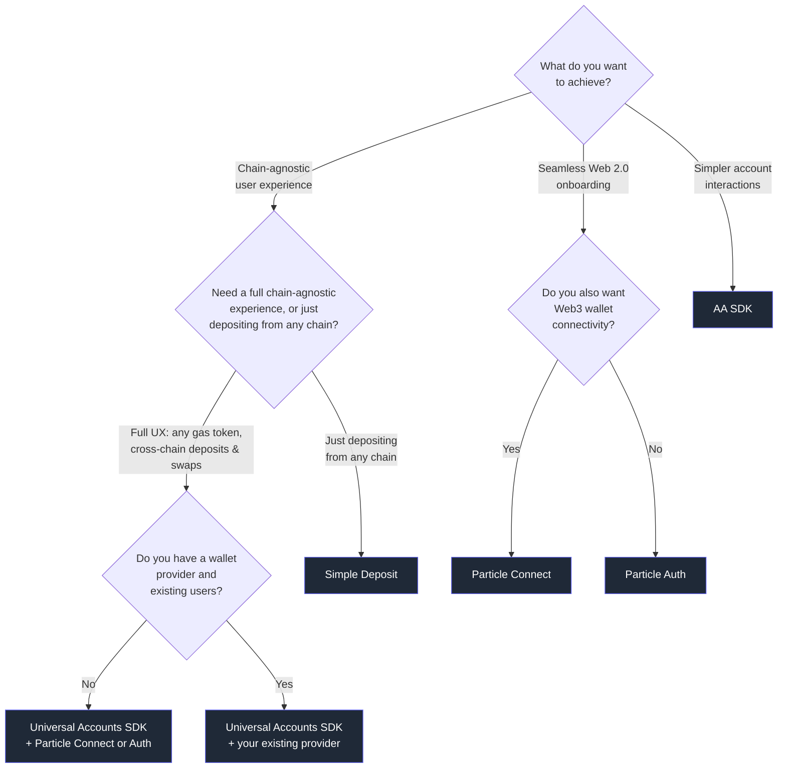

Particle Network ships five SDKs. They're independent, free to use, and designed to compose. **Most apps pick a stack of two or more** — for example, a signer (Particle Auth or Connect) plus Universal Accounts.

This page helps you pick that stack. Use the flow chart to reason it out, or jump straight to your scenario below.

---

## Pick a stack

---

## Recommended stacks

Pick the scenario that matches your app — each links to the right starting point.

<CardGroup cols={2}>
  <Card title="New multi-chain app" icon="rocket" href="/universal-accounts/overview">
    Cross-chain UX from day one. **Universal Accounts SDK** + **Particle Connect** (or **Auth** for social-only onboarding).
  </Card>
  <Card title="Existing app, add chain abstraction" icon="layer-group" href="/universal-accounts/how-to/provider">
    Keep your users and wallet stack. **Universal Accounts SDK** + your existing provider — no migration.
  </Card>
  <Card title="Onboard users, no seed phrases" icon="user-plus" href="/social-logins/overview">
    Social login → instant wallet. **Particle Connect** for a wallet picker, **Particle Auth** for a branded custom UI.
  </Card>
  <Card title="Accept deposits from any chain" icon="arrow-down-to-bracket" href="/simple-deposit/overview">
    Single-chain app, funds arrive as USDC. **Simple Deposit** — wallet-agnostic, no other UX changes.
  </Card>

</CardGroup>
  <Card title="Smart accounts, full control" icon="gear" href="/aa/introduction">
    Direct bundler & paymaster access. **AA SDK** — ERC-4337 primitives, pair with any signer.
  </Card>

---

## Particle Auth vs Particle Connect

Both turn a social login into a wallet. Here's how they differ.

| | Particle Connect | Particle Auth |
|---|---|---|
| **Logins** | Social + external wallets | Social only |
| **UI** | Pre-built modal | Fully customizable |
| **Account Abstraction** | Built in | Add via AA SDK |
| **Best for** | A drop-in that covers everyone | A branded Web2-style sign-in |

---

## SDK glossary

A one-line summary of everything Particle Network ships.

| Product | What it does |
|---|---|
| **Universal Accounts SDK** | One account and unified balance across all supported chains. Users never bridge. Uses EIP-7702 so existing wallets opt in without migrating funds. → [Docs](/universal-accounts/overview) |
| **Simple Deposit** | Per-chain deposit addresses; funds auto-bridge to your destination chain as USDC. Wallet-agnostic. Not compatible with Particle Connectkit/Authkit. → [Docs](/simple-deposit/overview) |
| **Particle Connect** | Drop-in modal for social logins and external wallets. AA-enabled viem provider built in. → [Docs](/social-logins/connect/introduction) |
| **Particle Auth** | Social login → EOA. Full UI customization. Pair with the AA SDK for smart-account features. → [Docs](/social-logins/auth/introduction) |
| **AA SDK** | ERC-4337 bundler + paymaster + smart account management. Use it directly when you want primitives. → [Docs](/aa/introduction) |

<Tip>
  **Can I use Universal Accounts without Particle Auth or Connect?**

  Yes. The Universal Accounts SDK is provider-agnostic — pair it with Particle Connect, Particle Auth, RainbowKit, Web3Modal, wagmi, or any signer that exposes a standard wallet provider.
</Tip>
