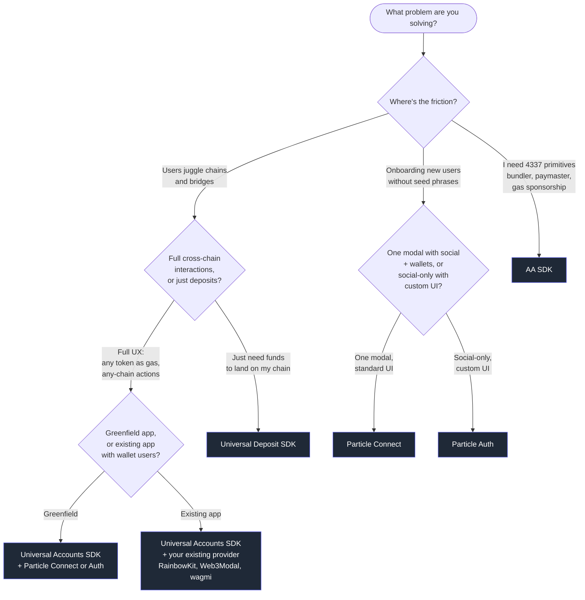

Particle Network ships five SDKs. They're independent, free to use, and designed to compose. **Most apps pick a stack of two or more** — for example, a signer (Particle Auth or Connect) plus Universal Accounts.

This page helps you pick that stack. Start with the flow chart, then jump to the matching recipe below.

---

## Pick a stack

---

## Recommended stacks

### Greenfield multi-chain dApp

You're building from scratch and want users to interact across chains as if it were one. Pair Universal Accounts with a signer.

<CardGroup cols={2}>
  <Card title="Universal Accounts SDK" icon="user" href="/universal-accounts/overview">
    Single account and balance across all supported chains.
  </Card>
  <Card title="+ Particle Connect" icon="plug" href="/social-logins/connect/introduction">
    One modal for social logins and external wallets, AA included.
  </Card>
</CardGroup>

Use **Particle Auth** instead of **Particle Connect** if you want social-only onboarding with full UI control.

---

### Existing dApp adding chain abstraction

You already have users and a wallet stack (RainbowKit, Web3Modal, wagmi, plain viem). You want chain abstraction without migrating your users.

<CardGroup cols={2}>
  <Card title="Universal Accounts SDK" icon="user" href="/universal-accounts/overview">
    Provider-agnostic — wraps your existing wallet provider.
  </Card>
  <Card title="Your existing provider" icon="wallet" href="/universal-accounts/how-to/provider">
    Keep RainbowKit, Web3Modal, or any signer you already ship.
  </Card>
</CardGroup>

<Note>
  Universal Accounts use EIP-7702 to let users spend their existing assets through their Universal Account without migrating funds. In-place EOA upgrade behavior depends on the connected wallet — the SDK itself works with any provider.
</Note>

---

### Onboarding-first, social-only, custom UI

Your priority is a branded Web2-style sign-in. You don't need a wallet picker.

<CardGroup cols={2}>
  <Card title="Particle Auth" icon="user-plus" href="/social-logins/auth/introduction">
    Social login → instant EOA. Full UI control, embeddable.
  </Card>
  <Card title="+ AA SDK (optional)" icon="layer-group" href="/aa/introduction">
    Add smart-account features (gas sponsorship, batching) on top.
  </Card>
</CardGroup>

Add the Universal Accounts SDK on top if you also need chain abstraction.

---

### Single-chain app that wants any-chain deposits

Your app lives on one chain. You want users to fund it from wherever their money already is, and have it arrive as USDC on your chain — no other UX changes required.

<CardGroup cols={1}>
  <Card title="Universal Deposit SDK" icon="arrow-down-to-bracket" href="/universal-accounts/ua-reference/universal-deposit/overview">
    Generates a deposit address per chain. Funds auto-bridge to your destination chain as USDC. Wallet-agnostic.
  </Card>
</CardGroup>

<Warning>
  Universal Deposit is **not compatible with Particle Connectkit or Authkit**. Use it with your own auth/wallet stack, or alongside a separate Particle Connect / Auth integration scoped to other flows.
</Warning>

---

### Raw 4337 primitives

You want direct control over smart accounts, UserOperations, the bundler, and the paymaster. You're not asking for chain abstraction.

<CardGroup cols={1}>
  <Card title="AA SDK" icon="layer-group" href="/aa/introduction">
    ERC-4337 stack — bundler, paymaster, smart account management. Pair with any signer.
  </Card>
</CardGroup>

---

## Particle Auth vs Particle Connect

Both produce a usable wallet from a social login. The difference is what else they do and how much UI you own.

| | **Particle Connect** | **Particle Auth** |
|---|---|---|
| **Login surface** | Social logins **and** external wallets in one modal | Social logins only |
| **UI** | Pre-built modal, limited customization | Fully customizable — embed inline, build your own buttons |
| **Account Abstraction** | Built in (AA-enabled viem provider out of the box) | Not included — pair with the AA SDK if you want smart accounts |
| **Pick it when** | You want a single drop-in modal that covers everyone | You want a branded Web2-style sign-in with no wallet picker |

<CardGroup cols={2}>
  <Card title="Particle Connect →" icon="plug" href="/social-logins/connect/introduction" />
  <Card title="Particle Auth →" icon="user-plus" href="/social-logins/auth/introduction" />
</CardGroup>

---

## SDK glossary

A reference list of everything Particle Network ships.

| Product | What it does |
|---|---|
| **Universal Accounts SDK** | One account and unified balance across all supported chains. Users never bridge. Uses EIP-7702 so existing wallets can opt in without migrating funds. → [Docs](/universal-accounts/overview) |
| **Universal Deposit SDK** | Per-chain deposit addresses. Funds auto-bridge to your destination chain as USDC. Wallet-agnostic. → [Docs](/universal-accounts/ua-reference/universal-deposit/overview) |
| **Particle Connect** | Drop-in modal for social logins and external wallets. AA-enabled viem provider built in. → [Docs](/social-logins/connect/introduction) |
| **Particle Auth** | Social login → EOA. Full UI customization. Pair with the AA SDK for smart-account features. → [Docs](/social-logins/auth/introduction) |
| **AA SDK** | ERC-4337 bundler + paymaster + smart account management. Use it directly when you want primitives. → [Docs](/aa/introduction) |

---

## FAQ

<AccordionGroup>
  <Accordion title="Universal Accounts SDK vs Universal Deposit SDK — which do I need?">
    Both come from the same chain-abstraction stack, but they solve different problems.

    - **Universal Accounts SDK** changes how *every* interaction in your app works. Users have one balance across chains, can pay gas in any token, and can take any action from any of their balances. This is the SDK to integrate when your dApp is multi-chain by design.
    - **Universal Deposit SDK** only handles the funding step. Your app stays single-chain; users deposit from wherever their money is, and it arrives as USDC on your chain. No other changes to your app.

    Rule of thumb: if you're asking "how do users *get* funds into my app?", that's Universal Deposit. If you're asking "how do users *do things* across chains?", that's Universal Accounts.
  </Accordion>

  <Accordion title="Can I use Universal Accounts without Particle Auth or Connect?">
    Yes. The Universal Accounts SDK is provider-agnostic. You can pair it with Particle Connect, Particle Auth, RainbowKit, Web3Modal, wagmi, or any signer that exposes a standard wallet provider. Particle Auth is optional.
  </Accordion>

  <Accordion title="I already have an app with existing wallet users. Will Universal Accounts disrupt them?">
    No migration is required. The Universal Accounts SDK leverages EIP-7702 so a user's existing wallet can be upgraded to a Universal Account in place — assets stay where they are. You can also keep Universal Accounts as an optional toggle alongside EOAs if you prefer to leave the default UX untouched.

    Note: in-place EOA upgrade depends on the connected wallet's support for EIP-7702. The SDK works with any provider; the upgrade affordance varies by wallet.
  </Accordion>

  <Accordion title="What's the difference between Particle Auth and Particle Connect?">
    See the [Auth vs Connect](#particle-auth-vs-particle-connect) section above. Short version: Connect is a pre-built modal that covers social *and* external wallets and ships with AA support built in. Auth is social-only with full UI control; pair it with the AA SDK if you want smart accounts.
  </Accordion>

  <Accordion title="Do I need the AA SDK if I'm using Particle Connect?">
    No. Particle Connect already exposes an AA-enabled viem provider, so smart-account features are available without integrating the AA SDK separately. Reach for the AA SDK when you want to drive the bundler or paymaster directly, or when you're using a signer (like Particle Auth or your own) that doesn't include AA.
  </Accordion>
</AccordionGroup>
